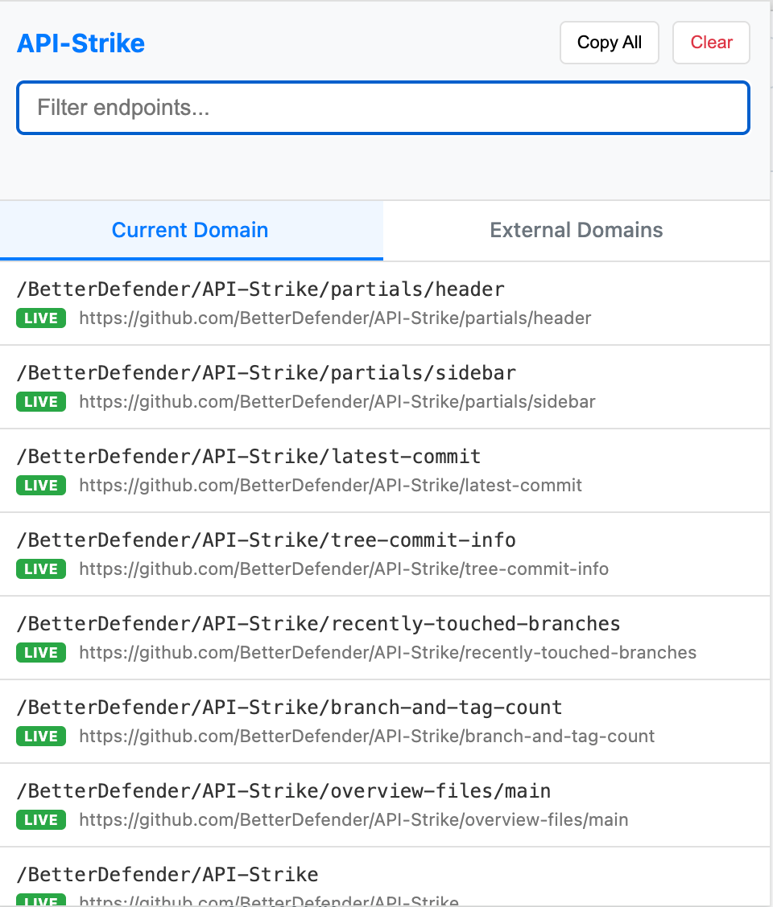

  <h1>API-Strike 🚀</h1>
  

    <a href="#english">English</a> | <a href="#中文">中文</a>
  

---

## English

API-Strike is a powerful browser extension designed for developers and security researchers to automatically capture and discover API endpoints from any webpage. Unlike traditional network monitors, it combines **live interception** with **static code analysis** to give you a complete map of a site's API surface.

### ✨ Key Features

-   **Live Interception**: Automatically captures all `XHR` and `fetch` requests made by the page in real-time.
-   **Static Discovery**: Scans external JS files, inline scripts, and the DOM to find potential endpoints mentioned in the code that haven't been called yet.
-   **Smart Categorization**:
    *   **Current Domain**: Dedicated tab for internal APIs with automatic full-URL reconstruction for relative paths.
    *   **External Domains**: Tracks third-party services and CDNs.
-   **Noise Filtering**: Advanced logic to exclude Base64 blobs, tokens, encrypted strings, and static assets (images, fonts, etc.).
-   **Deduplication**: Automatically merges identical endpoints discovered through different methods.
-   **Developer Workspace**:
    *   Real-time search and filtering.
    *   "Copy All" functionality (respects active filters).
    *   Clean, modern UI with easy-to-read labels ([LIVE] vs [DISC]).

### 🛠 Installation

1.  Clone this repository or download the source code.
2.  Open Chrome/Edge and navigate to `chrome://extensions/`.
3.  Enable **"Developer mode"** in the top right corner.
4.  Click **"Load unpacked"** and select the `api-strike-extension` folder.

---

## 中文

API-Strike 是一款专为开发者和安全研究人员设计的浏览器插件，能够自动捕获并发现网页中的所有 API 接口。与传统的网络监控工具不同，它结合了**实时拦截**与**静态代码分析**，为你呈现完整的网页接口图谱。

### ✨ 核心功能

-   **实时拦截**：实时捕获页面发出的所有 `XHR` 和 `fetch` 请求。
-   **静态发现**：扫描外部 JS 文件、内联脚本及 DOM 结构，挖掘代码中潜伏的、尚未被调用的 API 路径。
-   **智能分类**：
    *   **当前域名 (Current Domain)**：专门展示本站接口，并自动为相对路径（如 `/api/v1`）拼接完整 URL。
    *   **外部域名 (External Domains)**：追踪第三方服务、接口网关及 CDN。
-   **深度过滤**：内置高级过滤引擎，自动剔除长 Base64 数据、Token、加密乱码以及静态资源（图片、字体等）。
-   **智能去重**：自动合并通过不同方式发现的重复接口。
-   **高效工作区**：
    *   支持实时搜索和关键字过滤。
    *   一键“拷贝全部”功能（遵循当前搜索结果）。
    *   现代化的 UI 界面，清晰标注接口来源（[LIVE] 实时抓取 vs [DISC] 静态发现）。

### 🛠 安装步骤

1.  克隆本仓库 or 下载源码到本地。
2.  打开 Chrome 或类 Chromium 浏览器，进入 `chrome://extensions/`。
3.  在右上角开启 **“开发者模式”**。
4.  点击 **“加载已解压的扩展程序”**，选择 `api-strike-extension` 文件夹即可。

  

---

### 📄 License

MIT License

🤖 Generated with [Claude Code](https://claude.com/claude-code)
